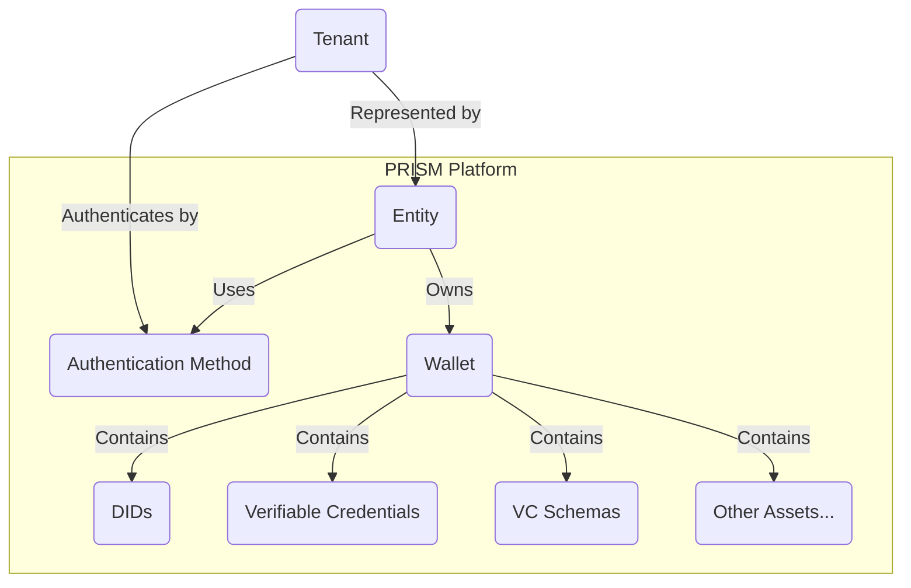

# Multi-Tenancy

## Introduction

### Purpose

Multi-tenancy is a fundamental capability of the PRISM platform designed to provide secure and efficient identity and credential management for a diverse range of users, identities, and organizations.
It enables the platform to serve multiple tenants while ensuring the logical isolation of their assets.

### Key Benefits

- Scalability: PRISM's multi-tenancy support allows the platform to scale effortlessly to accommodate a growing number of users, entities, and organizations.
- Resource Efficiency: It optimizes resource utilization by enabling the sharing of infrastructure components, enhancing cost-effectiveness.
- Data Isolation: Multi-tenancy ensures that the data, such as DIDs (Decentralized Identifiers), connections, VCs (Verifiable Credentials), keys, and more, of one tenant is completely isolated from others, preserving data privacy and security.
- Enhanced Collaboration: Shared Wallets enable collaboration between entities while maintaining data segregation.
- Granular Control: administrators have granular control over the resources and permissions assigned to each entity.

## Concepts

### Tenant

A Tenant is a logical entity that represents an organization or a group of users within the PRISM platform.
Each tenant is represented by an Entity, which is the primary entity for managing and interacting with the tenant's digital assets.

### Wallet

A Wallet is a central component of PRISM's multi-tenancy model.
It serves as the container for storing and managing a tenant's digital assets, including DIDs, connections, VCs, keys, and more.
Wallets are logically isolated to ensure that the data associated with one entity remains separate and secure from others.

### Entity

An Entity is a representation of a user or any other identity within the PRISM platform.
Each Entity owns a Wallet, making it the primary entity for managing and interacting with its digital credentials and assets.
Entities can also share Wallets, enabling collaborative use of resources.

### Authentication Method

Each Entity is associated with an Authentication Method, which serves as a secure means of verifying the identity and access rights of the Entity.
This method ensures the Entity's identity is authenticated during interactions with the platform, enhancing security.

### Logical Isolation
Logical Isolation is a core principle of PRISM's multi-tenancy model. 
It ensures that the digital assets, transactions, and data of one Entity are logically separated from those of other Entities, maintaining the highest level of data privacy and security.

### Shared Wallets
PRISM's multi-tenancy capabilities allow for the sharing of Wallets among multiple Entities. 
This feature facilitates collaborative work and resource sharing while preserving data isolation within the shared Wallet.
The Entity can own only one Wallet, so the Wallet can be shared with other Entities, but it cannot be owned by multiple Entities.

### Tenant Management
Tenant Management is the process of onboarding, provisioning, and managing Entities and Wallets within the PRISM platform. 
Administrators have the authority to configure permissions, resources, and access control for each Entity, ensuring efficient and secure multi-tenancy operations.

### DIDComm Connections
DIDComm Connections are the secure channels of communication between peers within the SSI ecosystem.
PRISM's multi-tenancy model ensures that the connections of one Entity are logically isolated from those of other Entities, preserving data privacy and security.
Based on the DID-Peer of the message recipient, the corresponding Wallet is used to process the message.

## Relation Diagram

The following diagram illustrates the relationship between the key components of PRISM's multi-tenancy model.

