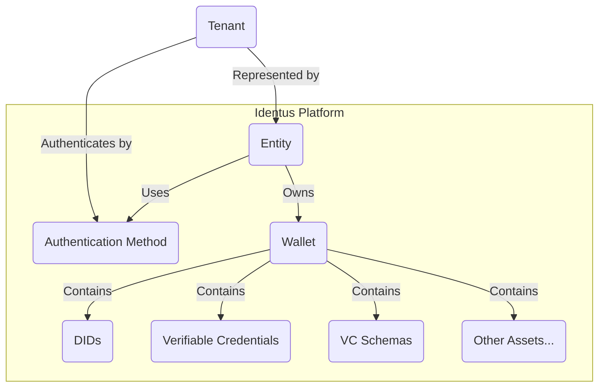

# Multi-Tenancy

## Introduction

### Purpose

Multi-tenancy is a fundamental capability of the Identus toolset designed to provide secure and efficient identity and credential management for diverse users, identities, and organizations. It enables the platform to serve multiple tenants while ensuring the logical isolation of their assets.

### Key Benefits

- **Scalability**: Identus' multi-tenancy support allows the platform to scale effortlessly to accommodate growing users, entities, and organizations.
- **Resource Efficiency**: It optimizes resource utilization by enabling the sharing of infrastructure components, enhancing cost-effectiveness.
- **Data Isolation**: Multi-tenancy ensures that the data, such as DIDs (Decentralized Identifiers), connections, VCs (Verifiable Credentials), keys, and more, of one tenant is completely isolated from others, preserving data privacy and security.
- **Enhanced Collaboration**: Shared wallets enable collaboration between entities while maintaining data segregation.
- **Granular Control**: Administrators control the resources and permissions assigned to each entity.

## Roles in multi-tenancy

Multi-tenancy permits multiple users or systems to use the Cloud Agent within a shared instance, enhancing resource utilization while preserving each tenant's and their resources' separation. Understanding different roles in multi-tenancy is essential for the secure and efficient operation of the Cloud Agent.

### Administrator

The administrator's primary responsibilities include setting up, allocating, and managing tenant resources. Administrators have elevated privileges within the system, allowing them to create, modify, or delete multi-tenant resources such as entities, wallets, and authentication methods. They play a critical role in tenant management but typically don't participate in everyday interactions.

### Tenant

Tenants are the users or systems engaged in everyday interactions. They have representation via a resource called an entity, and this entity uses a wallet as a container for the assets they own. Tenants can only view the assets within the wallet assigned to their entity. To access the system, they need an authentication method provided by the administrator.

## Concepts

### Wallet

A wallet is a central component of Identus' multi-tenancy model. It serves as the container for storing and managing a tenant's digital assets, including DIDs, connections, VCs, keys, and more. Wallets are logically isolated to ensure that the data associated with one entity remains separate and secure from others.

### Entity

An entity represents a user or any other identity within the Identus platform. Each entity owns a Wallet, making it the primary entity for managing and interacting with its digital credentials and assets. Entities can also share wallets, enabling collaborative use of resources.

### Authentication Method

Each entity is associated with an Authentication Method, which serves as a secure means of verifying the identity and access rights of the entity. This method ensures the entity's identity is authenticated during interactions with the platform, enhancing security.

### Logical Isolation
Logical Isolation is a core principle of Identus' multi-tenancy model. It ensures that one entity's digital assets, transactions, and data are logically separated from others, maintaining the highest data privacy and security level.

### Shared Wallets
Identus' multi-tenancy capabilities allow for the sharing of wallets among multiple entities. This feature facilitates collaborative work and resource sharing while preserving data isolation within the shared wallet. The entity can own only one wallet. Sharing it with other entities is possible, but multiple entities cannot own it.

### Tenant Management
Tenant Management is the process of onboarding, provisioning, and managing entities and wallets within the Identus platform. Administrators can configure each entity's permissions, resources, and access control, ensuring efficient and secure multi-tenancy operations.

### DIDComm Connections
DIDComm Connections are the secure communication channels between peers within the SSI ecosystem. Identus' multi-tenancy model ensures that the connections of one entity are logically isolated from those of other entities, preserving data privacy and security. Based on the DID-Peer of the message recipient, the corresponding wallet processes the message.

### Webhook Notifications
Webhook notifications enable users to receive alerts for specific events in the system. There are two types of webhook notifications:
- Global webhooks: monitor all events across all wallets at the Cloud Agent level
- Wallet webhooks: isolated to individual wallets and do not have visibility into assets in other wallets.

## Relation Diagram

The following diagram illustrates the relationship between the key components of Identus' multi-tenancy model.

