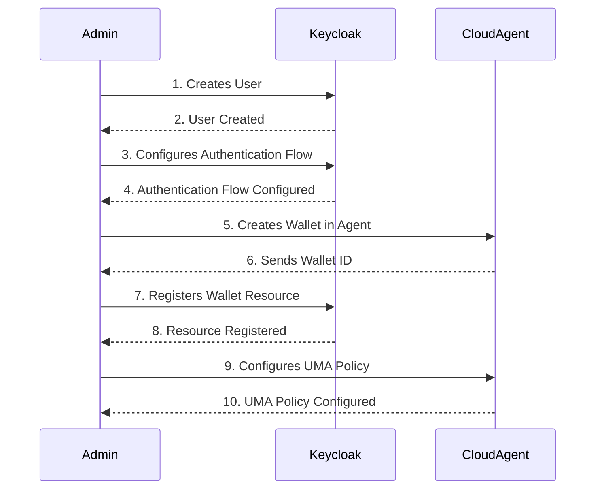
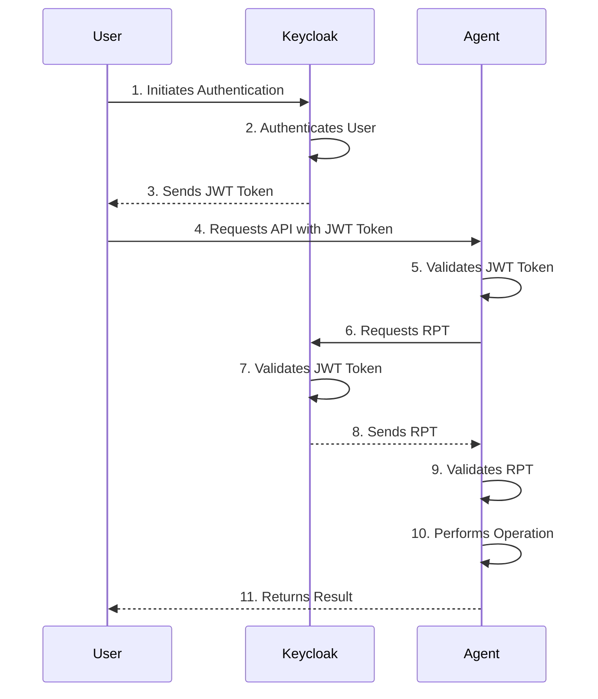

# Authentication and Authorisation

Authentication is the process of verifying an entity's identity and the tenant associated with the entity.
Authorization verifies that an entity has the necessary permissions to access the requested information.
resource.

Authentication and authorization are critical to any identity management system, ensuring only authorized
users can access the system and its resources.

Cloud Agent provides the following authentication and authorization methods to ensure that the identity of the
entity is verified and authenticated during interactions with the platform:

- apikey authentication with internal IAM service
- admin-api-key authentication
- JWT token authentication and authorization with external IAM service Keycloak

## Default Entity and Wallet

The Cloud Agent uses the Default Entity and the Default Wallet for all interactions with the Agent over the REST API and DIDComm in the single-tenant mode.
A Default Entity is an entity with the id `00000000-0000-0000-0000-000000000000`, and a Default Wallet is a wallet with the id `00000000-0000-0000-0000-000000000000`.


## API Key Authentication

### Introduction

API Key Authentication is a straightforward method used to authenticate entities by utilizing a secret key. This method requires the inclusion of an `apikey` header in HTTP requests, with the value corresponding to the issued secret key. The configuration of API Key Authentication for an entity is managed by the Administrator using the Entity API methods.


### Security and Restrictions
- **API Key Length**: To maintain robust security, the length of the API Key value must exceed 16 bytes (128 bits). This length requirement is essential for enhancing the security of your API Key against potential attacks. The max length of the API Key value is limited to 128 bytes. Unique API Keys: Each API Key is unique to a specific entity. It cannot be shared or reused by other entities. If an attempt to assign the same API Key value to another entity, the API Key is considered compromised and must be considered unusable.
- **Unique API Keys:** Each API Key is unique to a specific entity. It cannot be shared or reused by other entities. If an attempt to assign the same APIKey value to another entity, the APIKey is considered compromised and must be considered unusable.
- **Revocation:** In case of a tenant's API Key revocation, it becomes invalid for authentication.


### Agent Responsibilities

The Agent manages API Keys for each tenant and maintains the security of the system:

- **API Key Storage:** The Agent maintains each tenant's APIKeys list. However, it is essential to note that the original value of the APIKey is not stored in the Agent, ensuring additional security.
- **Hashing and Authentication:** The Agent securely stores the hash of the APIKey in the database and uses it to authenticate the entity. The hashing process employs the `SHA-256` algorithm and a `salt` value to compute the hash value, ensuring data integrity and security during authentication. The length of the `salt` value must exceed 16 bytes (128 bits)


Based on the configuration API Key authentication, the Cloud Agent can support the following interaction models:

### Single Tenant without apikey authentication

Disable API key authentication and use the Default Wallet for all interactions with the Cloud Agent over the REST API and DIDComm.

| Environment Variable | Value |
|----------------------|-------|
| API_KEY_ENABLED      | false |


### Single Tenant with apikey authentication

Enable API key authentication and use the Default Wallet for all interactions with the Cloud Agent over the REST API and DIDComm. 

| Environment Variable                 | Value |
|--------------------------------------|-------|
| API_KEY_ENABLED                      | true  |
| API_KEY_AUTHENTICATE_AS_DEFAULT_USER | true  |

### Multi-Tenant with apikey authentication

Enable APIKey authentication and use the Entity and the Wallet associated with the API-Key for all interactions with the Cloud Agent. The Administrator must register the Entity and Wallet for the tenant before the first interaction with the Cloud Agent over the REST API.

| Environment Variable                 | Value |
|--------------------------------------|-------|
| API_KEY_ENABLED                      | true  |
| API_KEY_AUTHENTICATE_AS_DEFAULT_USER | false |


### Multi-Tenant with apikey authentication and auto-provisioning

Enable APIKey authentication and use the Wallet associated with the APIKey for all interactions with the Cloud Agent. Automatically register the tenant's Entity, Wallet, and API key during the first interaction with the Cloud Agent over the REST API.

| Environment Variable                 | Value |
|--------------------------------------|-------|
| API_KEY_ENABLED                      | true  |
| API_KEY_AUTHENTICATE_AS_DEFAULT_USER | false |
| AUTO_PROVISIONING_ENABLED            | true  |

## Admin-Api-Key Authentications

Admin-Api-Key authentication is an authentication method that uses a secret key to authenticate the Administrator. Adding the `x-admin-api-key` header to the HTTP request with the value of the issued secret is required. The value of the `x-admin-api-key` header gets configured in the Cloud Agent at the startup.

| Environment Variable | Value  |
|----------------------|--------|
| ADMIN_API_KEY        | secret |

The following REST APIs get protected by the Admin-Api-Key authentication methods:

- Wallet Management REST API
- Entity Management REST API


## JWT Token Authentication and Authorisation with the Keycloak

### Introduction

[Keycloak](https://www.keycloak.org/) is an open-source identity and access management solution that provides robust
authentication, authorization, and user management capabilities.
It allows organizations to secure their applications and services by centralizing user authentication and authorization
processes.
Keycloak supports various identity protocols, including OAuth 2.0 and OpenID Connect, making it a versatile solution for
securing modern web applications.

The Cloud Agent utilizes the following Keycloak features:

- Authentication with JWT Token with a configured flow according to
  the [ADR](https://staging-docs.atalaprism.io/adrs/adr/20230527-use-keycloak-and-jwt-tokens-for-authentication-and-authorisation-to-facilitate-multitenancy-in-cloud-agent/)
- Authentication with JWT Token
  using [token exchange](https://www.keycloak.org/docs/latest/securing_apps/index.html#_token-exchange)
- Authorization with `roles` claim supporting both Keycloak [RealmRole](https://www.keycloak.org/docs/latest/server_admin/#proc-creating-realm-roles_server_administration_guide) and [ClientRole](https://www.keycloak.org/docs/latest/server_admin/#con-client-roles_server_administration_guide)
- Authorization with JWT Token and RPT according
  to [authorization services](https://www.keycloak.org/docs/latest/authorization_services/index.html#authorization-services)
  based
  on [UMA 2.0 specification](https://docs.kantarainitiative.org/uma/wg/rec-oauth-uma-grant-2.0.html#:~:text=This%20specification%20defines%20a%20means,a%20resource%20owner%20authorizes%20access.)
  and [ADR](https://staging-docs.atalaprism.io/adrs/adr/20230926-use-keycloak-authorisation-service-for-managing-wallet-permissions/)

When the JWT Token authentication is enabled, it includes protection for all multi-tenant and administrative endpoints of the Cloud Agent.
Two mechanisms get utilized in JWT authorization:

1. __Role-based authorization__  
   It implements this [ADR](https://staging-docs.atalaprism.io/adrs/adr/20240103-use-jwt-claims-for-agent-admin-auth/), which can authorize both the administrator and tenant role.
   Each role is allowed to operate on different parts of the Agent
   Administrators are permitted to oversee the wallet management, while tenants are allowed to utilize the wallet and engage in SSI interactions.

2. __UMA resource permission__  
   When the role is tenant, the Agent must know which wallet the tenant can access.
The UMA permission model is employed to configure the tenant's permissions for the wallet.

### Sequence Diagrams

The following sequence diagrams illustrate the Cloud Agent and Keycloak interaction during the authentication and authorization processes.

#### User onboarding and configuration



#### User Authentication



### Role-based authorization

The Agent has a simple mechanism for role-based authorization.
It expects the JWT to include a `roles` claim in the payload, identifying the role such as `admin` or `tenant`.
The user must belong to one of these roles but not both. If unspecified, the Agent infers the `tenant` role.
The location of the `roles` claim is also configurable, allowing flexible IAM configuration.
As a result, the Agent can support both Keycloak `RealmRoles` and `ClientRoles` based on the configuration.
Using the environment variable, set the path as: `KEYCLOAK_ROLES_CLAIM_PATH`.

If Keycloak `RealmrRole` is used, follow this [instruction](https://www.keycloak.org/docs/latest/server_admin/#proc-creating-realm-roles_server_administration_guide) on Keycloak
and the `KEYCLOAK_ROLES_CLAIM_PATH` should be set to `realm_access.roles`.

If Keycloak `ClientRole` is used, follow this [instruction](https://www.keycloak.org/docs/latest/server_admin/#con-client-roles_server_administration_guide) on Keycloak
and the `KEYCLOAK_ROLES_CLAIM_PATH` should be set to `resource_access.<KEYCLOAK_CLIENT_ID>.roles`.

### UMA permission configuration

The current authorization logic is built on the UMA specification, configuring permissions as user A controls resource W. In this model, user A is a registered user in Keycloak, and wallet W is a resource registered in Keycloak.

These configurations are managed manually in Keycloak. However, for a better experience, the Agent can execute these actions through the REST API endpoint. 
For each wallet, a corresponding resource gets created with the name wallet-`wallet_id` in Keycloak. 
Similarly, a corresponding policy is created for each user and resource with the name user `userId` on wallet `wallet_resource_name` permission.

The REST API endpoint to configure permissions in Keycloak is:

```
POST /wallets/{walletId}/uma-permissions
```

with a body containing subject as UUID.

Authenticated users (admin or the user owning the wallet) can configure permissions in Keycloak for the wallet.

### Migration from `apikey` authentication

The `apikey` authentication can work in parallel with the JWT authentication to call the REST API endpoints together with the JWT token.

The migration from API key authentication to JWT authentication is possible using the following steps:

- Create a user in Keycloak.
- Configure the authentication flow in Keycloak.
- Call the REST API endpoint to configure permissions in Keycloak with a valid API key token.
- Authenticate with Keycloak and obtain the JWT token.
- Call the REST API endpoints with a valid JWT token.

## Self-Service Wallet Registration

The Cloud Agent supports self-service wallet registration for the users.
When the user is registered in the Keycloak and has the valid JWT token, the user can register the wallet in the Cloud
Agent.
You can use the wallet management endpoints of the REST API for wallet registration:

```
POST /wallets 
{
    "seed": "secured-seed-value",
    "name": "wallet-name"
}
```

The user can register the wallet only for himself, so the `x-api-key` header is not required and the `seed` value is not
shared.

The corresponding wallet resource is created in Keycloak, and the user is granted access to this resource.

