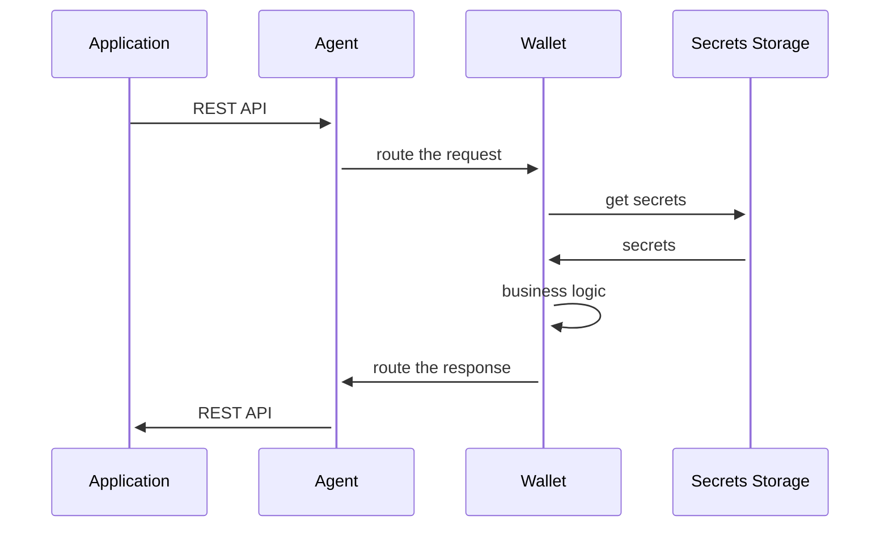

# Secrets Storage

## Introduction

To ensure maximum security, storing sensitive information, including secrets, actively and securely in the [Secrets Storage](</home/concepts/glossary#secrets-storage>). The Cloud Agent manages the following types of secrets:

- **seed**: a secret used to derive cryptographic keys
- **private key**: a secret used to sign and decrypt data
- any other sensitive data from entities' (for instance, credential definition and the link-secret used by the AnonCreds)

The default secret storage for the Cloud Agent is the [HashiCorp Vault Service](</home/concepts/glossary#vault-service>). Other implementations of secret storage can be implemented based on the needs.

## Technical Overview

### Secrets Engine Configuration

The Vault service uses a secrets engine to store secrets. KV2 secrets engine is used to keep secrets in the Vault service and provides the following features:

- encrypted at rest
- encrypted in transit
- versioned
- can be deleted, restored, and rolled back to a previous version
- available via REST API, WEB UI, and command client

### Secrets Storage Sequence Diagram



### Naming Convention for the Vault Assets

Each asset is assigned a unique name to store the assets in the Vault service. The Vault is a key/value store with metadata attached to the key and versioning.

The naming convention for the Vault assets is a matter of implementation. For a multi-tenant configuration, the Wallet requires all the asset storage under the path containing the `wallet-id'.

As an example, the `seed` could be stored in the path below:

```
<wallet-id>/seed value=<base64-encoded-value> <metadata>
```

The following path can store the private keys for the DID:

```
<wallet-id>/dids/prism/<did-ref>/keys/<key-purpose>/<key-index>/<operation-hash> value=<base64-encoded-value> <metadata>
```

where:

- `wallet-id` is the unique identity of the Wallet
- `did-ref` is the DID ref
- `key-purpose` is the key purpose according to the PRISM DID Method specification
- `key-index` is the key index. Starting from 0 and increasing incrementally after each key rotation
- `operation-hash` is the reference to the updated DID document operation
- `base64-encoded-value` is the base64-encoded value of the key
- `metadata` is the key/value metadata attached to the key used to store additional information about the key, such as `seed` or `key-derivation-path`

The following path can store the key material of the DID peer:

```
<wallet-id>/dids/peer/<did-ref>/keys/<key-purpose> value=<base64-encoded-value> <metadata>
```

## Links:

- [HashiCorm Vault](https://www.vaultproject.io/)
- [Vault KV Secrets Engine](https://www.vaultproject.io/docs/secrets/kv/kv-v2)
