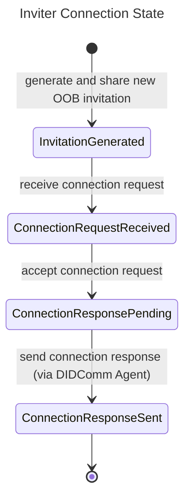
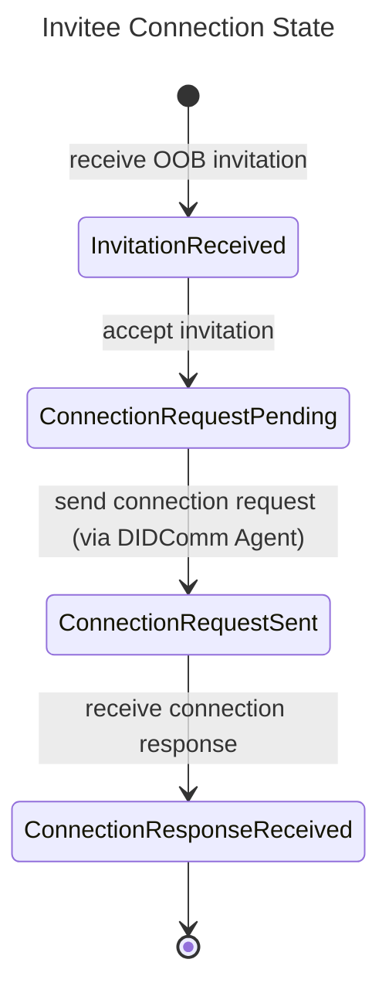

# Connecting agents

The Connection protocol mechanism creates, manages, and accepts connections between two Atala PRISM Agents.
A connection is a stateful relationship between two parties that enables secure communication.

The Connection protocol is required to establish secure connections between agents,
allowing them to exchange information and interact.

The protocol provides endpoints for creating and managing connections, as well as for accepting invitations.
The protocol ensures that only authorized agents can access the connections and their associated information, which is critical for maintaining the privacy and security of the connected agents and the information they exchange.

The endpoints can be easily integrated into existing applications, providing a convenient and secure way to establish connections between agents.

## Prerequisites

1. **Inviter** and **Invitee** PRISM Agents up and running

## Roles

The protocol has two roles:

1.  **Inviter**: A PRISM Agent that initiates a connection request by sending a connection invitation.
2.  **Invitee**: A PRISM Agent that receives a connection invitation and accepts it by sending a connection request.

## PRISM Agent endpoints overview

The protocol uses the following REST API endpoints:

1. `/connections`:
   - `POST`: Creates a new connection and returns an invitation 
   - `GET`: Returns a list of connections
2. `/connections/{connectionId}`:
   - `GET`: Returns an existing connection record by id
3. `/connection-invitations`:
   - `POST`: Accepts an externally received invitation

For more detailed information, please, check the full API specification of the PRISM Agent.

## Inviter Flow

1.  Generate and share a new Out-of-Band (OOB) invitation (connection is created in `InvitationGenerated` state)
2.  Receive a connection request from the **Invitee** (connection is moved to `ConnectionRequestReceived` state)
3.  Accept the connection request (connection is moved to `ConnectionResponsePending` state)
4.  Send the connection response via the DIDComm Agent (connection achieves `ConnectionResponseSent` state)

The **Inviter**'s state transitions are represented by the following Mermaid diagram:



## Invitee Flow

1.  Receive the OOB invitation (`InvitationReceived` state)
2.  Accept the invitation (connection is created in `ConnectionRequestPending` state)
3.  Send the connection request via the DIDComm Agent (connection achieves `ConnectionRequestSent` state)
4.  Receive the connection response (connection achieves `ConnectionResponseReceived` state)

The **Invitee**'s state transitions are represented by the following Mermaid diagram:


## Command line example

The following example demonstrates on how you could use two PRISM Agents API to set up connection between them.

### **Inviter** creates an invitation

```shell
curl -X 'POST' \
	'http://localhost:8080/prism-agent/connections' \
	-H 'Content-Type: application/json' \
	-d '{ "label": "Connect with Alice" }' | jq
```

Example response:
```json
{
  "connectionId": "1893e207-4cba-4792-8179-067c78d2acc2",
  "createdAt": "2023-02-02T17:14:13.593647Z",
  "invitation": {
    "from": "did:peer:inviter-did",
    "id": "1893e207-4cba-4792-8179-067c78d2acc2",
    "invitationUrl": "https://domain.com/path?_oob={RAW_INVITATION}",
    "type": "https://didcomm.org/out-of-band/2.0/invitation"
  },
  "kind": "/connections/1893e207-4cba-4792-8179-067c78d2acc2",
  "label": "Connect with Alice",
  "self": "Connection",
  "state": "InvitationGenerated"
}
```

### **Invitee** accepts OOB invitation

Replace `{RAW_INVITATION}` with the value of the '_oob' query string parameter from the invitation URL above
```shell
curl -X 'POST' \
	'http://localhost:8090/prism-agent/connection-invitations' \
	-H 'Content-Type: application/json' \
	-d '{ "invitation": "{RAW_INVITATION}" }' | jq
```

Example response:
```json
{
  "connectionId": "755a457a-878e-4292-a3f2-cb83601f802e",
  "createdAt": "2023-02-02T18:05:58Z",
  "invitation": {
    "from": "did:peer:inviter-did",
    "id": "1893e207-4cba-4792-8179-067c78d2acc2",
    "invitationUrl": "https://domain.com/path?_oob={RAW_INVITATION}",
    "type": "https://didcomm.org/out-of-band/2.0/invitation"
  },
  "kind": "/connections/755a457a-878e-4292-a3f2-cb83601f802e",
  "myDid": "did:peer:invitee-did",
  "self": "Connection",
  "state": "ConnectionRequestPending",
  "theirDid": "did:peer:inviter-did",
  "updatedAt": "2023-02-02T18:05:59Z"
}
```

### **Invitee** retrieves the list of connections

```shell
curl -X 'GET' 'http://localhost:8090/prism-agent/connections' | jq
```

Example output:
```json
{
  "contents": [
    {
      "connectionId": "755a457a-878e-4292-a3f2-cb83601f802e",
      "createdAt": "2023-02-02T18:05:58Z",
      "invitation": {
        "from": "did:peer:issuer-did",
        "id": "1893e207-4cba-4792-8179-067c78d2acc2",
        "invitationUrl": "https://domain.com/path?_oob={RAW_INVITATION}",
        "type": "https://didcomm.org/out-of-band/2.0/invitation"
      },
      "kind": "/connections/755a457a-878e-4292-a3f2-cb83601f802e",
      "myDid": "did:peer:holder-did",
      "self": "Connection",
      "state": "ConnectionResponseReceived",
      "theirDid": "did:peer:issuer-did",
      "updatedAt": "2023-02-02T18:06:14Z"
    }
  ],
  "kind": "Collection",
  "self": "/collections"
}
```

### **Inviter** retrieves the list of connections

```shell
curl -X 'GET' 'http://localhost:8080/prism-agent/connections' | jq
```

Example response:
```json
{
  "contents": [
    {
      "connectionId": "1893e207-4cba-4792-8179-067c78d2acc2",
      "createdAt": "2023-02-02T17:14:13Z",
      "invitation": {
        "from": "did:peer:issuer-did",
        "id": "1893e207-4cba-4792-8179-067c78d2acc2",
        "invitationUrl": "https://domain.com/path?_oob={RAW_INVITATION}",
        "type": "https://didcomm.org/out-of-band/2.0/invitation"
      },
      "kind": "/connections/1893e207-4cba-4792-8179-067c78d2acc2",
      "label": "Connect with Alice",
      "myDid": "did:peer:issuer-did",
      "self": "Connection",
      "state": "ConnectionResponseSent",
      "theirDid": "did:peer:holder-did",
      "updatedAt": "2023-02-02T18:06:16Z"
    }
  ],
  "kind": "Collection",
  "self": "/collections"
}
```

:::info
For more detailed information, please, check the full **[PRISM Agent API](/agent-api).**
:::
