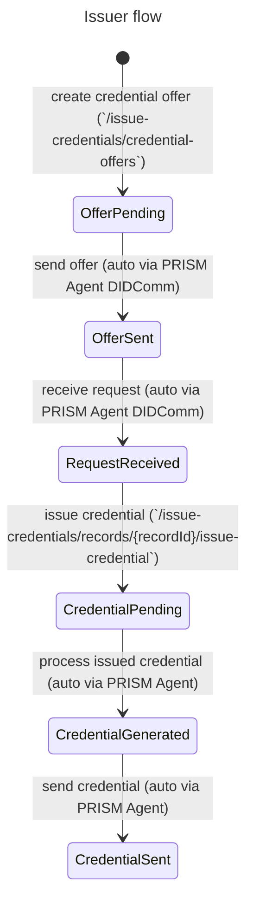
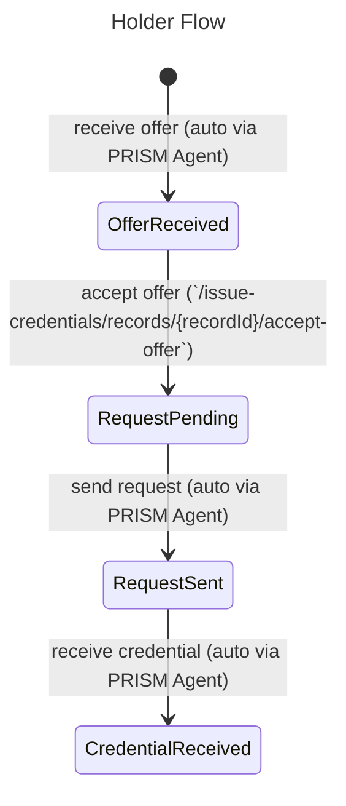

# Issuing Credentials

In Atala PRISM, the Issue Credentials Protocol allows you to create, retrieve, and manage issued verifiable credentials (VCs) between a VC issuer and a VC holder.

## Roles

In the **Issue Credentials Protocol**, there are two roles:

1. **Issuer** is responsible for creating a new credential offer, sending it to a **Holder**, and issuing the VC once the offer is accepted.
2. **Holder** is responsible for accepting a credential offer from an issuer and receiving the VC.

The **Issuer** and **Holder** interact with the **PRISM Agent API** to perform the operations defined in the protocol.


## Prerequisites

Before using the Issuing Credentials protocol, the following conditions must be present:

1. **Issuer** and **Holder** PRISM Agents up and running
2. A connection must be established between the **Issuer** and **Holder** PRISM Agents (see [Connection Protocol](../connections/connection.md))

## Overview

The protocol described is a VC issuance process between two Atala PRISM Agents, the **Issuer** and the **Holder**.

The protocol consists of the following main parts:

1. The **Issuer** creates a new credential offer using the `/issue-credentials/credential-offers` endpoint, which includes information such as the schema identifier and claims.
2. The **Holder** can then retrieve the offer using the `/issue-credentials/records` endpoint and accept the offer using the `/issue-credentials/records/{recordId}/accept-offer` endpoint.
3. The **Issuer** then uses the `/issue-credentials/records/{recordId}/issue-credential` endpoint to issue the credential, which gets sent to the Holder via DIDComm. The Holder receives the credential, and the protocol is complete.

:::tip
Additional parameters such as `validityPeriod`, `automaticIssuance`, and `awaitConfirmation`<br />
can be included in the credential offer to provide more control over the issuance process.
:::

The schema identifier defines the structure and the credential type issued,
while the claims provide specific information about the individual, such as their name or qualifications.

This protocol is applicable in various real-life scenarios, such as educational credentialing, employment verification, and more.
In these scenarios, the **Issuer** could be a school, an employer, etc., and the **Holder** could be a student or an employee.
The VCs issued during this protocol could represent a diploma, a certificate of employment, etc.

## Endpoints

| Endpoint | Description | Role |
| --- | --- | --- |
| `/issue-credentials/credential-offers` | This endpoint allows you to create a new credential offer | Issuer |
| `/issue-credentials/records` | This endpoint allows you to retrieve a collection of all the existing credential records | Issuer, Holder |
| `/issue-credentials/records/{recordId}` | This endpoint allows you to retrieve a specific credential record by its `id` | Issuer, Holder |
| `/issue-credentials/records/{recordId}/accept-offer` | This endpoint allows you to accept a credential offer | Holder |
| `/issue-credentials/records/{recordId}/issue-credential` | This endpoint allows you to issue a VC for a specific credential record. | Issuer |


:::info
For more detailed information, please, check the full **[PRISM Agent API](/agent-api).**
:::

## Issuer interactions

This section describes the Issuer role's available interactions with the PRISM Agent.

### Creating a Credential Offer

To start the process, the issuer needs to create a credential offer.
To do this, make a `POST` request to the `/issue-credentials/credential-offers` endpoint with a JSON payload that includes the following information:

1.  `subjectId`: This field represents the unique identifier for the subject of the verifiable credential. It is a DID (Decentralized Identifier) string, such as `did:prism:subjectofverifiablecredentials`.
2.  `validityPeriod`: This field represents the time (in seconds) the verifiable credential will remain valid. In this example, the validity period is 3600 seconds.
3.  `automaticIssuance`: This field represents whether the verifiable credential issuance is automated. If set to false, the issuer will manually review the request and decide whether to issue the credential. If set to true, the issuer will automatically issue the credential as soon as the request is received.
4.  `awaitConfirmation`: This field represents whether the holder must confirm the receipt of the verifiable credential before the protocol is complete. If set to false, the protocol will be complete as soon as the credential gets sent to the holder. If set to true, the holder must send a confirmation message to the issuer to indicate that the credential is received. The protocol will only be complete once confirmation is received.
5.  `schemaId`: This is an identifier for a schema, which defines the structure and format of the data in a verifiable credential. The schema identifier must be unique and typically a URL or a URN.
6.  `claims`: The data stored in a verifiable credential. Claims get expressed in a key-value format and must conform to the structure and format defined in the schema. The claims contain the data that the issuer attests to, such as name, address, date of birth, and so on.

Once the request initiates, a new credential record for the issuer gets created with a unique ID. The state of this record is now `OfferPending`.

```shell
# Issuer POST request to create a new credential offer
curl -X 'POST' \
  'http://localhost:8080/prism-agent/issue-credentials/credential-offers' \
    -H 'accept: application/json' \
    -H 'Content-Type: application/json' \
    -d '{
          "schemaId": "schema:1234",
          "subjectId": "did:peer:subject-of-credential-issuance",
          "validityPeriod": 3600,
          "automaticIssuance": false,
          "awaitConfirmation": false,
          "claims": {
            "firstname": "Alice",
            "lastname": "Wonderland",
            "birthdate": "01/01/2000"
          }
	    }'
```

:::tip
You could use the `jq` command line tool to extract `recordId` from the response and use it later in the credentials issuance step.
:::

:::info
To get a `did:peer` and use the `subjectId` of a credential offer request, a connection requirement is between the **Issuer** and **Holder** PRISM Agents.

Extraction from a `Connection` object is achievable
by executing `theirDid` field from `GET` request to `/connections/{connectionId}`, where `connectionId` is the connection between **Issuer** and **Holder**.
:::

:::caution
For now, only `did:peer` has support as a credential issuance `subjectId`.
`did:prism` will be available in the following Atala PRISM updates.
:::

### Sending the Offer to the Holder

The next step for the **Issuer** is to send the offer to the holder using DIDComm.
To do this, the **Issuer** agent will process the offer and send it to the holder agent.
This process is automatic. The state of the **Issuer**'s record will change to `OfferSent`.

### Issuing the Credential

Once the holder has approved the offer and sent a request to the **Issuer**,
the **Issuer** will receive the request via DIDComm and update the state of the record to `RequestReceived.`

The **Issuer** can then use the `/issue-credentials/records/{recordId}/issue-credential` endpoint to issue the credential to the holder.

```shell
# Issuer POST request to issue the credential
# make sure you have `issuer_record_id` extracted from created credential offer
# and the record achieved `RequestReceived` state
curl -X POST \
    "http://localhost:8080/prism-agent/issue-credentials/records/$issuer_record_id/issue-credential" \
    -H "Content-Type: application/json"
```

When this endpoint gets called, the state of the record will change to `CredentialPending,` and after processing, it will change to `CredentialGenerated.`

Finally, the **Issuer** agent will send the credential to the holder via DIDComm,
and the state of the record will change to `CredentialSent`.
At this point, the **Issuer**'s interactions with the holder are complete.



## Holder interactions

This section describes the Holder role's available interactions with the PRISM Agent.

### Receiving the VC Offer

The **Holder** will receive the offer from the **Issuer** via DIDComm,
and a new credential record with a unique ID will be created in the `OfferReceived` state.

This process is automatic for the PRISM Agent.

You could check if a new credential offer is available using `/issue-credentials/records` request:
```shell
# Holder GET request to retrieve credential records
curl "http://localhost:8090/prism-agent/issue-credentials/records" \
    -H "Content-Type: application/json"
```

:::tip
Use could use `jq` to filter `curl` results to extract required `recordId` for achieved credential offer.
:::

### Approving the VC Offer

To accept the offer, the **Holder** can make a `POST` request to the `/issue-credentials/records/{recordId}/accept-offer` endpoint:
```shell
# Holder POST request to accept the credential offer
curl -X POST "http://localhost:8090/prism-agent/issue-credentials/records/$holder_record_id/accept-offer" \
    -H "Content-Type: application/json"
```

This request will change the state of the record to `RequestPending`.

### Receiving the VC Credential

Once the **Holder** has approved the offer and sent a request to the **Issuer**, the **Holder** agent will process the request and send it to the **Issuer** agent.
The state of the **Holder**'s record will change to `RequestSent`.

After the **Issuer** has issued the credential, the **Holder** will receive the credential via DIDComm, and the state of the **Holder**'s record will change to `CredentialReceived`.
This process is automatic for the PRISM Agent.

**Holder** can check the achieved credential using a GET request to `/issue-credentials/records/{recordId}/` endpoint.


